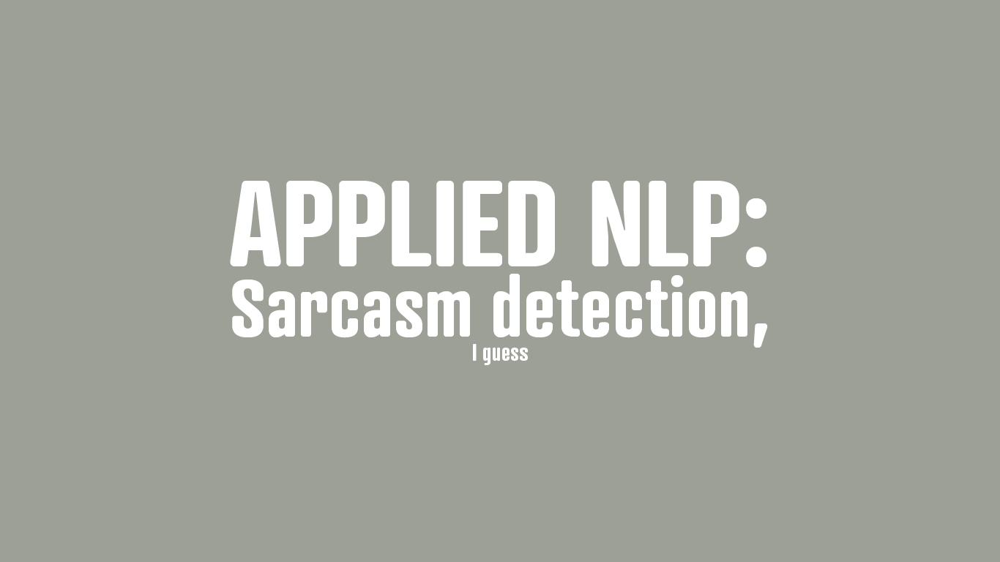

# sarcasm_detection
Sarcasm Detection using Logistic Regression and Random Forest Classifier

Sarcasm is one of the many kinds of social information that people regularly use in text. But despite the prevalence in everyday talk, it can be *really* hard to detect in text. The same goes for a neural network, and it is often far more challenging than other natural language processing topics. Luckily for us in today's age, we can help give each other and computers an indication of when sarcasm is used, such as emojis or TypYIng lIkE thIS, or using `\s` after a sarcastic comment. 

What makes sarcasm so hard to identify is that it often is very subtle of carries contrasting notions (positives with negatives). In the article *Why is sarcasm so difficult to detect in texts and emails?* on [The Conversation](https://theconversation.com/why-is-sarcasm-so-difficult-to-detect-in-texts-and-emails-91892) by Sara Peters uses this example:

Frank: I'm waiting at the front. Movie starts in 5.

Mike: I'm on my way now. Should be there in 10.

Frank: I'm glad you were watching the clock today.

In a real-life conversation, for most of us, sarcasm would be pretty easy to detect. We could be personally invested in this person and know that Mike is often late, so Frank poked at Mike with sarcasm. But what if the comment was sincere? Through text, this is much more ambiguous. 

For this project, we will be working with different sarcasm to help interpret this nuanced version and the less so. The [SARC 2.0](https://nlp.cs.princeton.edu/SARC/2.0/main/) are the sarcasm labels we will use; these come from user comments labeled `\s` at the end of comments on Reddit. We will start by loading the dependencies and gzip files and then looking into what the datasets entail.
